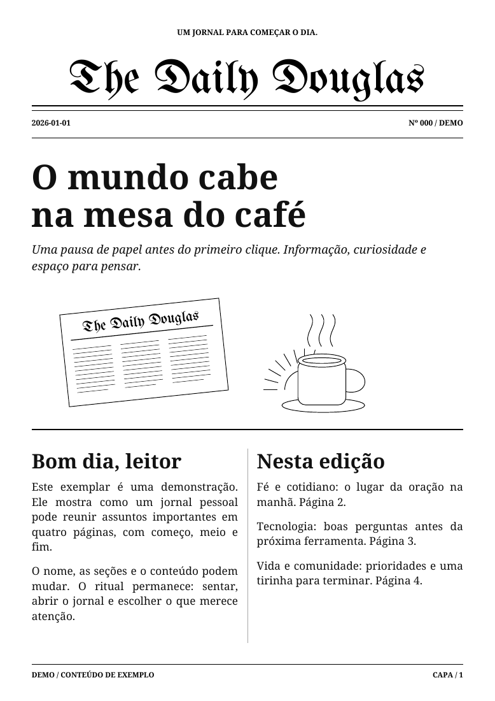

# The Daily Douglas

**Seu jornal pessoal. Quatro páginas. Uma pausa antes do primeiro clique.**

Um gerador local de jornais em PDF, com visual clássico, nome personalizável,
duas colunas, tirinha e montagem pronta para dobrar. Inspirado no
[The Morning Newspaper, de Karen X. Cheng](https://newspaper.karenx.com/).



## O que funciona nesta versão

- Geração de quatro páginas em meia folha A4, em ordem de leitura.
- PDF de impressão com duas páginas A4 em paisagem: `[4 | 1]` e `[2 | 3]`.
- Duas folhas impressas de um lado, ou uma folha frente e verso.
- Conteúdo fornecido por um arquivo JSON: seções, artigos, fontes e listas.
- Tirinha vetorial com legendas personalizáveis, ou imagem local própria.
- Fontes abertas incluídas; não depende de fontes instaladas no Mac.
- Detecção de excesso de texto: a edição falha com uma mensagem em vez de cortar conteúdo.
- Impressão opcional pelo CUPS, com prévia e registro para evitar envios duplicados.
- Uma skill do Codex para buscar conteúdo nas conexões do próprio usuário.

**O pacote Python não acessa suas contas nem escreve notícias por conta própria.**
Ele transforma conteúdo em PDF. A coleta e a redação ficam com o assistente e suas
ferramentas conectadas, ou com uma integração que você escreva para produzir o JSON.
Clonar este projeto não copia contas conectadas, autorizações ou tarefas agendadas.

## Experimente sem conectar nenhuma conta

Requer Python 3.11 ou superior.

```sh
git clone https://github.com/dodopok/the-daily-douglas.git
cd the-daily-douglas
python -m venv .venv
```

Ative o ambiente com `source .venv/bin/activate` no macOS/Linux ou
`.venv\Scripts\Activate.ps1` no PowerShell. Depois:

```sh
python -m pip install .
daily-douglas validate examples/edition.json
daily-douglas render examples/edition.json --output-dir outputs/demo
```

Abra `outputs/demo/2026-01-01-demo-reading.pdf` para ler e
`outputs/demo/2026-01-01-demo-a4.pdf` para imprimir.
O exemplo é explicitamente demonstrativo, não uma edição factual daquela data.

## Personalize

Copie `config.example.json` para `config.local.json`. Troque o nome do jornal,
o lema, as fontes de conteúdo e as preferências de impressão.
`config.local.json` é ignorado pelo Git.

```sh
daily-douglas render examples/edition.json --config config.local.json
```

Você pode ter um jornal de tecnologia, um boletim de família, uma edição de
notícias locais ou qualquer combinação que caiba nas quatro páginas.
A seção litúrgica é opcional. O exemplo usa o Estêvão e permite escolher o livro
de oração; o código `loc_2019` corresponde ao ACNA 2019 em português no projeto Estêvão.

Os campos `prepare_at` e `ready_by` documentam sua preferência. **Eles não criam um
agendamento**: configure a rotina no seu aplicativo ou agendador.

Veja o [contrato do conteúdo](docs/content.md) e as
[conexões e automação](docs/connections.md).

## Use com Codex

Abra este repositório como projeto e invoque:

```text
Use $daily-newspaper para montar a edição de hoje, seguindo config.local.json.
Gere os PDFs para minha revisão.
```

A skill está em `.agents/skills/daily-newspaper/SKILL.md`. Ela orienta a coleta,
a redação e a composição, mas cada pessoa precisa conectar suas próprias fontes.
Também é possível seguir suas instruções em outro assistente que consiga criar
arquivos e executar o gerador.

## Imprima e dobre

O PDF A4 já contém duas páginas do jornal por folha. No diálogo de impressão,
use **A4, paisagem, tamanho real (100%), uma página do PDF por folha**.

**Duas folhas, impressão simples:** imprima as duas páginas do PDF em folhas
separadas. Junte os lados em branco, alinhe o topo e dobre as duas folhas ao meio.
A capa fica do lado de fora. Há superfícies em branco entre as folhas.

**Uma folha, frente e verso:** use duplex pela borda curta. Faça uma prova no seu
modelo de impressora, porque os nomes e a orientação das opções podem variar.

No macOS/Linux com CUPS, consulte as filas com `lpstat -p -d`. Para ver o comando
que seria enviado, sem imprimir:

```sh
daily-douglas print outputs/demo/2026-01-01-demo-manifest.json --printer NOME_DA_FILA
```

Depois de revisar o PDF, envie uma cópia:

```sh
daily-douglas print outputs/demo/2026-01-01-demo-manifest.json --printer NOME_DA_FILA --submit --reviewed
```

Acrescente `--mode duplex` para a futura impressão frente e verso.
O registro em `state/` bloqueia novas tentativas para o mesmo jornal, data e tipo
(exemplo ou edição real), inclusive após um resultado incerto. Confira o registro
e a fila antes de tentar novamente. Aceitação pelo CUPS significa envio à fila,
não confirmação de que o papel saiu. No Windows, use o PDF no diálogo de impressão.

## Desenvolvimento

```sh
python -m pip install -e .
python -m unittest discover -s tests -v
```

O fluxo de testes do GitHub usa apenas conteúdo de demonstração. Os testes de
impressão simulam o CUPS e nunca enviam papel à impressora.

## Dados pessoais e publicação

Versione código, exemplos e documentação. Guarde conteúdo real em `private/`,
`work/` ou `outputs/`, e registros em `state/`; esses diretórios são ignorados.
Credenciais pertencem ao aplicativo conectado ou ao armazenamento privado de sua
integração. O projeto não precisa de uma chave de API para executar a demonstração.

As fontes externas e os textos que você inserir mantêm seus próprios termos e
licenças. A licença do código não concede direitos sobre artigos, traduções
bíblicas, e-mails ou conteúdo de terceiros. Os exemplos incluídos são originais.

## Licença e créditos

Código e exemplos: [MIT](LICENSE). Fontes: SIL Open Font License, com os avisos
originais incluídos; veja [THIRD_PARTY_NOTICES.md](THIRD_PARTY_NOTICES.md).
O projeto tem identidade própria e não é afiliado ao The New York Times.

Versão inicial: gerador e fluxo com assistente. Adaptadores autônomos de contas,
um painel de configuração e um serviço de agendamento próprio ficam para versões futuras.
